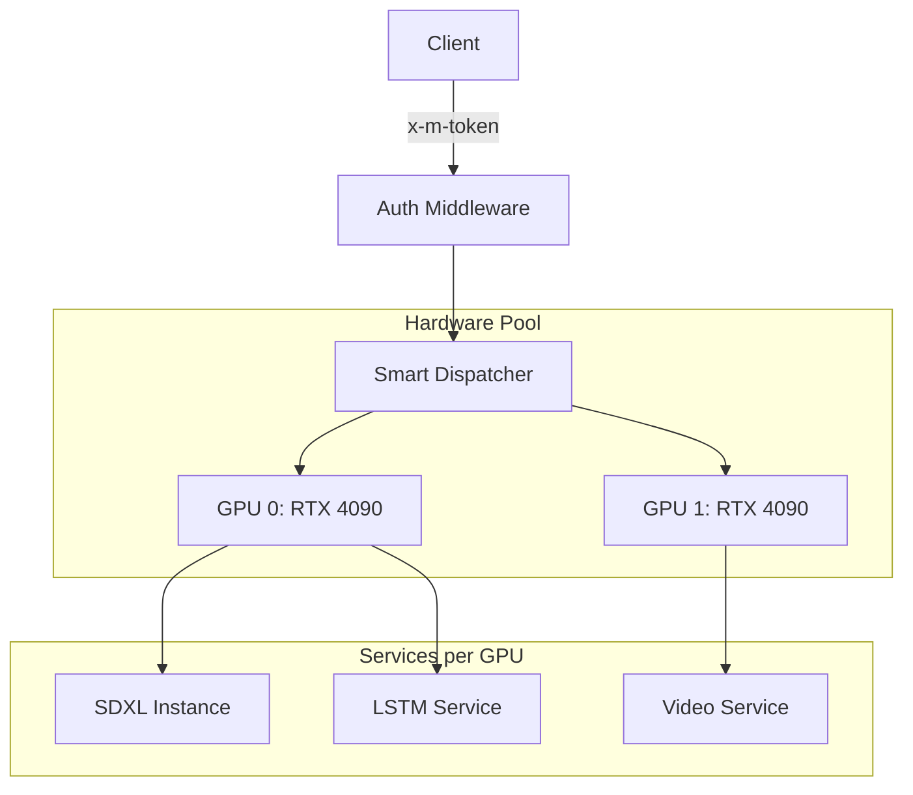

# 🚀 Multi-Model AI Platform (Multi-GPU Optimized)

Unified API for high-concurrency, uncensored AI generation — images, video, text, and audio. Optimized for **multi-GPU** deployments with prioritized task scheduling and smart VRAM management.

## 🌟 Key Features
- **Multi-GPU Scaling**: Automatic load-balancing across available GPUs.
- **Smart Priority Queue**: Text and Audio requests jump to the front of the line.
- **Enterprise Security**: Header-based authentication (`x-m-token`).
- **Lazy Loading**: Models are loaded on demand and evicted via LRU to optimize VRAM.

---

## 🛠️ API Reference

> [!IMPORTANT]
> **Authentication**: All `POST` requests require the `x-m-token` header.

### 🍱 System Endpoints

#### `GET /api/health`
Check system health, GPU memory, and ComfyUI instance status.
**Response**:
```json
{
  "status": "ok",
  "gpu_count": 2,
  "gpus": [
    {
      "gpu_id": 0,
      "name": "NVIDIA GeForce RTX 4090",
      "used_mb": 4012.5,
      "total_mb": 24576.0,
      "utilization": 16.3
    }
  ],
  "models": {
    "gpu_0": { "image": "loaded", "lstm": "loaded" }
  },
  "comfyui": [
    { "gpu": 0, "status": "ok" },
    { "gpu": 1, "status": "ok" }
  ]
}
```

#### `GET /api/models`
List current status (loaded/unloaded) of all models across all GPUs.
**Response**:
```json
{
  "models": {
    "gpu_0": { "image": "loaded", "text": "unloaded" },
    "gpu_1": { "video_t2v": "loading" }
  },
  "gpu_count": 2,
  "config": { "max_loaded_per_gpu": 3 }
}
```

#### `GET /api/idle-status`
Check the auto-shutdown timer and current idle duration.
**Response**:
```json
{
  "is_idle": true,
  "idle_seconds": 120,
  "shutdown_enabled": true,
  "minutes_until_shutdown": 28.0
}
```

---

### 💬 Text Generation

#### `POST /api/text/lstm/generate`
Ultra-fast, lightweight character-level generation (Highest Priority).
**Request**:
```json
{
  "prompt": "The future of AI is",
  "max_tokens": 100
}
```
**Response**:
```json
{
  "text": "The future of AI is bright and full of potential for humanity...",
  "prompt_tokens": 10,
  "completion_tokens": 40,
  "total_tokens": 50,
  "generation_time_seconds": 0.15,
  "device_id": 0
}
```

#### `POST /api/text/generate`
High-quality generation via Dolphin-Mixtral 8x7B.
**Request**:
```json
{
  "messages": [{"role": "user", "content": "Write a haiku about GPUs."}],
  "temperature": 0.7,
  "max_tokens": 512
}
```
**Response**:
```json
{
  "text": "Silicon humming,\nParallel paths light the dark,\nMatrix blooms in fire.",
  "prompt_tokens": 15,
  "completion_tokens": 20,
  "total_tokens": 35,
  "generation_time_seconds": 2.1
}
```

---

### 🖼️ Image Generation

#### `POST /api/image/generate`
High-resolution images via SDXL 1.0.
**Request**:
```json
{
  "prompt": "a futuristic forest with glowing mushrooms",
  "width": 1024,
  "height": 1024,
  "steps": 25
}
```
**Response**:
```json
{
  "images": ["<base64_encoded_png_data>"],
  "seed": 42,
  "prompt": "a futuristic forest with glowing mushrooms",
  "generation_time_seconds": 8.5
}
```

---

### 🎬 Video Generation

#### `POST /api/video/generate`
Cinematic video via Wan 2.1 (T2V or I2V).
**Request (T2V)**:
```json
{
  "prompt": "a sunset over a digital ocean",
  "mode": "t2v",
  "num_frames": 33
}
```
**Response**:
```json
{
  "video_base64": "<base64_encoded_mp4_data>",
  "prompt": "a sunset over a digital ocean",
  "mode": "t2v",
  "num_frames": 33,
  "generation_time_seconds": 45.2
}
```

---

### 🔊 Audio Generation

#### `POST /api/audio/generate`
Neural TTS and Voice Cloning via XTTS v2.
**Request**:
```json
{
  "text": "Welcome to the future of multi-modal AI.",
  "language": "en",
  "speed": 1.0
}
```
**Response**:
```json
{
  "audio_base64": "<base64_encoded_wav_data>",
  "text": "Welcome to the future of multi-modal AI.",
  "language": "en",
  "duration_seconds": 3.2,
  "generation_time_seconds": 1.5
}
```

---

### 🛑 Administrative

#### `POST /api/shutdown`
Immediately trigger an instance stop (Vast.ai compatible). Requires `x-m-token`.
**Response**:
```json
{
  "status": "shutdown_initiated",
  "message": "Instance will stop in ~2 seconds"
}
```

---

## 🏗️ Architecture



## 📜 License
Personal and research use permitted. Respective model licenses (Apache 2.0, RAIL++-M) apply.
